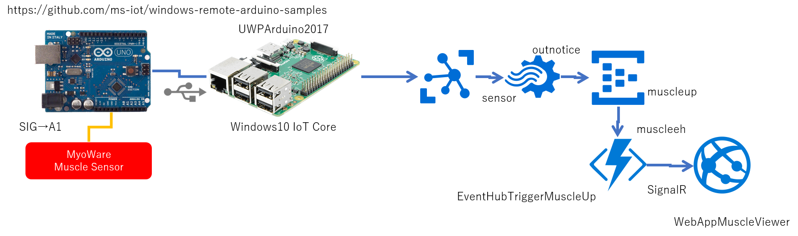

# Ardino -> UWP -> Azure IoT Sample 
Arduinoに接続されたアナログセンサーの値を定期的に読み取り、Windows 10 IoT Core上のUWPで収集し、クラウドに送付して、リアルタイムに可視化しつつグラフ化するサンプル。 
 
## 使用ハードウェア 
- Arduino 
- [MyoWare](https://www.switch-science.com/catalog/2682/) 
- Windows 10 IoT Coreが動くハードウェア、Raspberry Pi3など 
## 使用クラウドサービス 
- [Azure IoT Hub](https://docs.microsoft.com/azure/iot-hub/) 
- [Azure Stream Analytics](https://docs.microsoft.com/azure/stream-analytics/) 
- [Azure Storage Table](https://docs.microsoft.com/azure/storage/) 
- [Azure Event Hubs](https://docs.microsoft.com/azure/event-hubs/) 
- [Azure Functions](https://docs.microsoft.com/azure/azure-functions/) 
- [Web Apps](https://docs.microsoft.com/azure/app-service-web/) 
## 使用SDK 
- [Windows Remote Arduino](https://developer.microsoft.com/windows/iot/docs/wrae) 
- [Azure IoT SDK](http://github.com/Azure/azure-iot-sdks) 
- [ASP.NET SignalR](https://www.asp.net/signalr) 
## 手順 
[IoT Kitハンズオン資料](https://doc.co/kaXuNK/NsXXfD)を見つつ、Azure IoT Hub、Azure Stream Analytics、Azure Storage Table、Azure Event Hub、Azure Functions、Web Appsを作成する。 
Stream Analytics のクエリは、[StreamAnalytics/Script.asaql](StreamAnalytics/Script.asaql)を使う。 
Functionsのロジックや環境設定に必要なファイル群は、[Functions/EventHubTriggerMuscleUp](Functions/EventHubTriggerMuscleUp)に格納しているファイル群を使う。 
Arduinoからの筋電センサーの読み取り、IoT Hubへの送信は、[UWPArduino2017](UWPArduino2017)に格納されているVisual Studioプロジェクトを使う。MainPage.xaml.csの65行目付近の、 
```csharp
        private async void Button_Click(object sender, RoutedEventArgs e)
        {
            // IoT Hubに接続するための接続先とセキュリティ情報
            string cs = "<< Azure IoT Hub Connection String for Device Id >>";
            var client = DeviceClient.CreateFromConnectionString(cs, TransportType.Mqtt);
``` 
の"<< Azure IoT Hub Connection String for Device Id >>"の部分をAzure IoT Hubに登録したDeviceIdの接続文字列に変える。 
グラフ表示用のWebアプリは、[WebAppMuscleViewer](WebAppMuscleViewer)のVisual Studioプロジェクトを作成したWeb Appにデプロイする。 
デプロイしたWeb Appsの名前を、[Functions/EventHubTriggerMuscleUp/run.csx](Functions/EventHubTriggerMuscleUp/run.csx)の30行目付近の、 
```csharp
    // IoT Hubを介して、デバイスにメッセージ送信
    client.SendAsync("deviceRaspberryPi", noticeMessage);

    var hubConnection = new Microsoft.AspNet.SignalR.Client.HubConnection("http://[Web App Name].azurewebsites.net/");
    var proxy = hubConnection.CreateHubProxy("MuscleHub");
    hubConnection.Start().Wait();
```
"[Web App Name]"の部分に置き換える。 
また、同じファイルの、7行目付近 
```csharp
    var cs ="<< Azure Iot Hub Service Role Connection String >>";
    // Azure IoT HubにServiceロールで接続
``` 
の<< Azure Iot Hub Service Role Connection String >>を、Azure IoT Hubのserviceロールの接続文字列で置き換える。 
